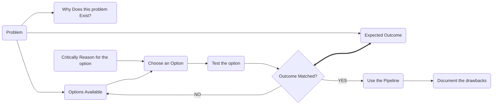

(Why, Where, When, What, Who, How)

![[ProblemSolving.drawio.png]]

[Draw.io](http://Draw.io)

## What is the problem?

- Determine gap in research.
- Too many resources, so hard to find notes at the time of writing the thesis.
- Difficult to retrieve the text from the note.
- Visualize connection? Can we solve the connection issue using tags?
    - I took a note. It is an important note.
    - Convert the note into an idea, and the note becomes the example of the idea.
    - Now, I have to see if it connects to any previous ideas.
    - If found a connection, organize it together.
    - If not, keep it separate.

## What is the expected outcome?

1. For my literature review, I look for all the sub topics at a single place.
2. I find ideas within each sub topics.
3. I take an idea from a sub topic.
4. I take the explaination and realted ideas for that.
5. I then write about it in thesis in my own words.

## Why does this problem exist?

### What does a literature review needs to have?

### Where does this info come from?

## What is the use of this pipeline and what problem is it trying to solve?

Fix above mentioned problems.

## How can this pipeline look like?

## Critical Questions

### Is this pipeline worth the time spent?

## References: